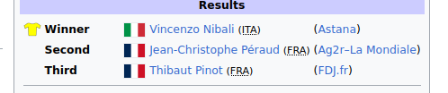

class: inverse, center, middle
background-image: url(https://image.cagle.com/213745/750/213745.png)
background-size: 250px
background-position: 90% 8%


```{r setup, include=FALSE}
options(htmltools.dir.version = FALSE)
```


# What is uncertainty?
--

<sup>1</sup>a situation in which something is not known. [Cambridge Dictionary]

---


# Type of uncertainty


--


.pull-left[
### Ontological view


Uncertainty is part of the world we observe.

### Epistemic view


Uncertainty is generated by our ignorance and limited knowledge.

]

.pull-right[

.right[]

]

--

 >Probability is the measure of uncertainty

---

# How do we "think"?

--

### Deductive reasoning

It is the foundation of logical reasoning, we start with assumptions/theory and we derive consequences using some form of "calculus".

--

> All men are mortal,  
> Socrates is a man 
>              => Therefore, Socrates is mortal

--

### Inductive reasoning

It is the process of going from a specific case to a general statement. 

--

> My neighbour told me that he  plays golf on Sunday
>             => Britons play golf on Sunday

--

#### we can use probability in both deductive and inductive reasoning
> but what is the meaning of a probability?

---


# What is Probability?


--

#### Frequentist Interpretation

The probability of an event is the limit of its relative fequency in an repetible experiment
> "The theory of probability can never lead to a definite statement concerning a single event." R Von Mises

--

#### Subjective Interpretation

The probability of an event/proposition is the __coherent__ personal belief of the event being true conditional on the state of knowledge 
> "Probability does not exist." B De Finetti


---

# The power of frequency

Probabilities as frequencies is a very appealing concept because:

- a frequency transform an abstract concept into a 'physical' measure

- it is embedded in our instinctive approach to assess the likelihood of events

.pull-left[

.right[]

]

--

but ...

- what do we do when we don't have frequencies? No frequency No probability.

- when we use inductive reasoning (i.e. data) is a frequentist interpretation our 'natural' way to think probabilities? 

---

# 1966 Football world cup final

.pull-left[

.right[]

]

--

.pull-right[

from Wikipedia:

>The 1966 FIFA World Cup final was a football match played at Wembley Stadium in London on 30 July 1966 to determine the winner of the 1966 FIFA World Cup, the eighth FIFA World Cup. The match was contested by England and West Germany...

]


-- 


#### What is the probability of England winning 1966 WC final?


---

# Tour de France 2014 (from Wikipedia)

The 2014 Tour de France was the 101st edition of the race, one of cycling's Grand Tours. The 3,660.5-kilometre (2,274.5 mi) race included 21 stages, starting in Leeds, Yorkshire, United Kingdom, on 5 July and finishing on the Champs-Élysées in Paris on 27 July. 

#### What is the probability of a British cyclist winning Tour de France 2014?

--

According to many observers before the race the top two favourites for the general classification were Chris Froome (Team Sky) and Alberto Contador (Tinkoff–Saxo).


#### Did this information changed your probability?

---

# Tour de France 2014

.pull-right[

.right[]

]


--

.pull-left[

.left[]

]


---
# The power of the subjective view

- Assume that probability is real (frequentist view). Then what can you say if I ask "what is a probability of tail with a coin that has two tails or two heads?"

- The subjective view stress the connection between probability and knowledge/information. 
--

- That's a very powerful concept. It allows as to think and compute probabilities of events already happened but for which we don't know the outcome.
--


  
### It is your ignorance that creates uncertainty (to you)!

---

